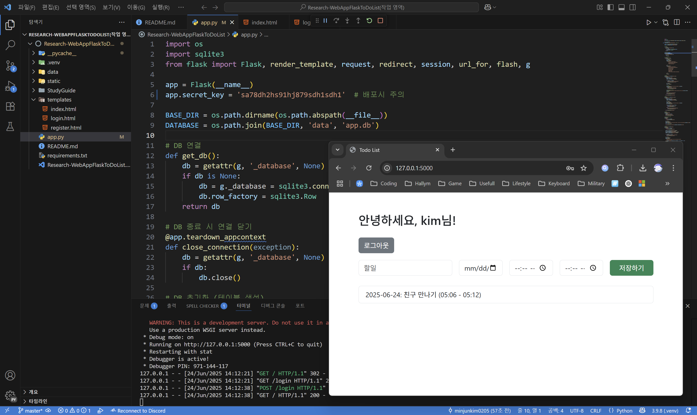

# 💻 Research-WebAppFlaskToDoList

## Preview



- ## Introduction

    > Flask, jinja, json 으로 간단간 투두 리스트 웹앱 만들기

- ## Requirements  

    > Python version : 3.9.8

    ```cmd
    pip install flask jinja2
    ```

- ## Note

    > [SCHEDULE](./SCHEDULE.md)
